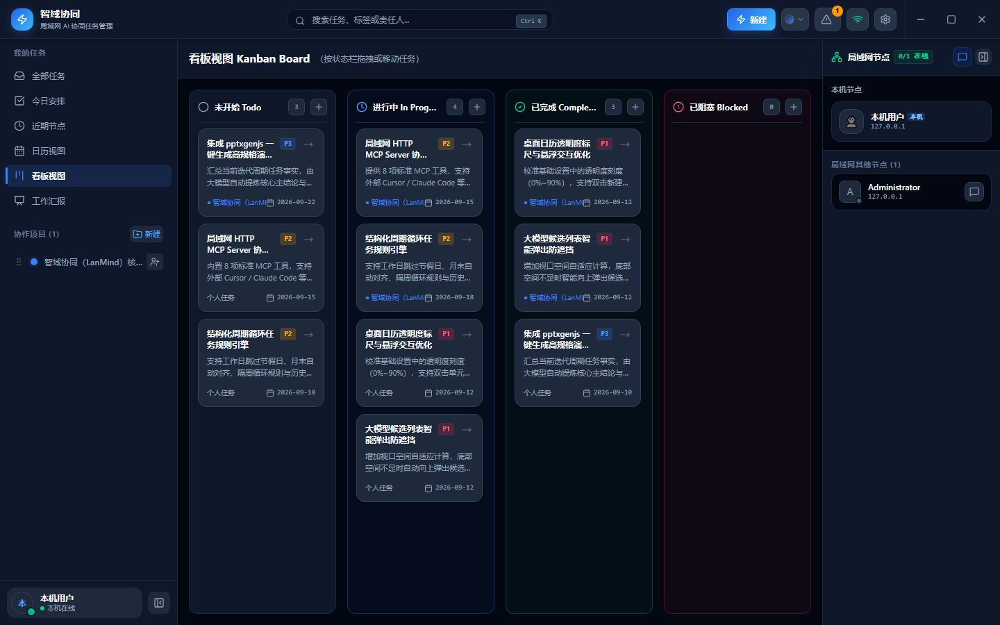
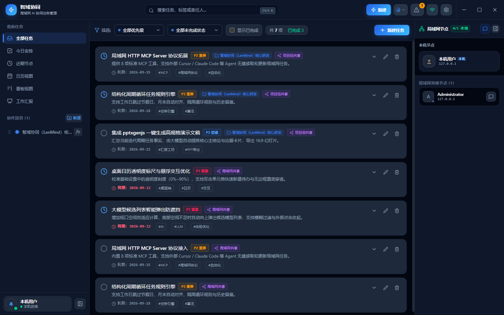
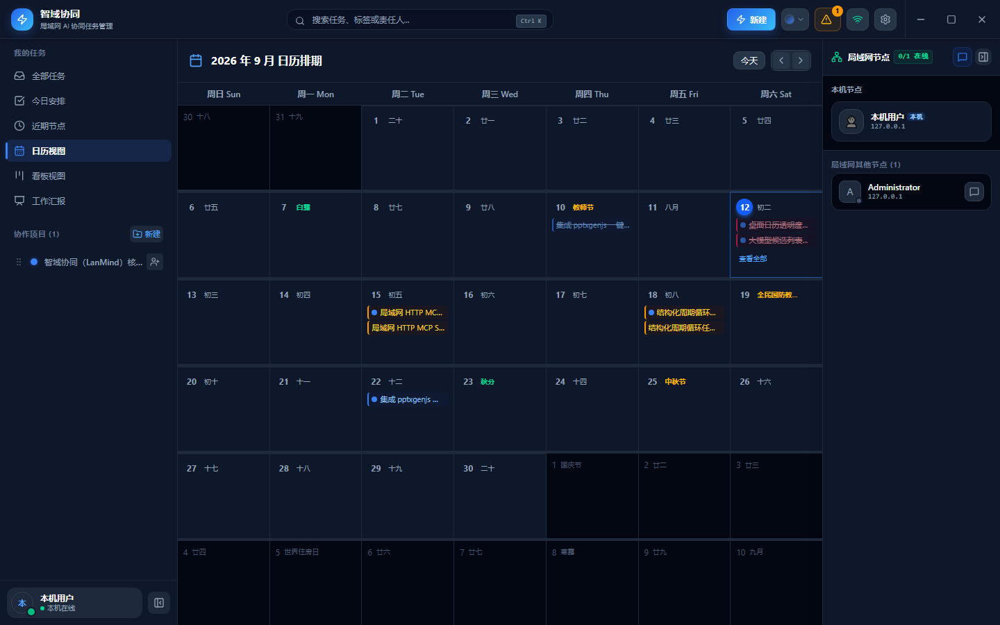
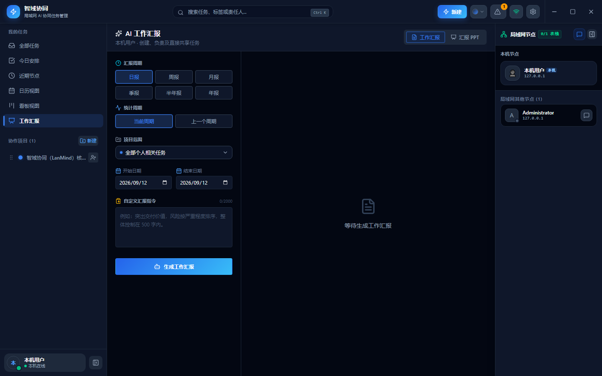
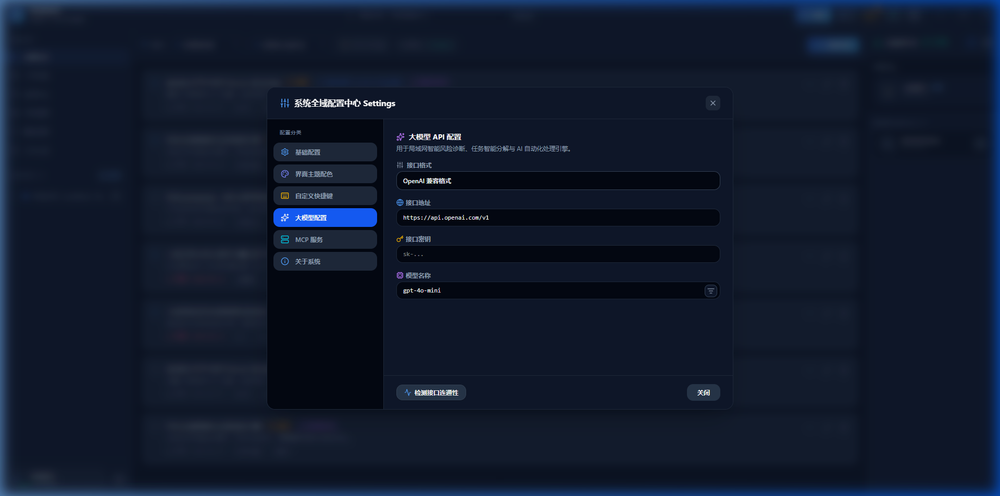
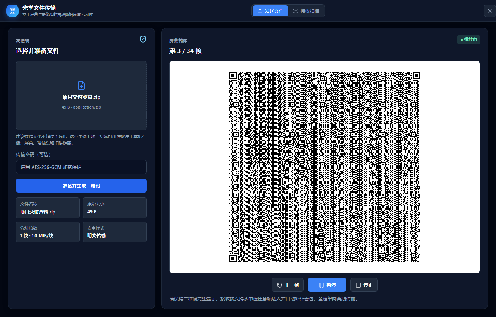

# 智域协同（LanMind）

> 当前桌面版本：0.2.0 · 跨平台（Windows / macOS / Linux） · Tauri 2 · React 19 · SQLite

智域协同是一款面向办公室、项目现场和隔离内网团队的本地优先协作桌面应用。它把项目、任务、沟通、文件传输、半透明桌面日历挂件和工作汇报集中在一个跨平台（Windows / macOS / Linux）客户端中，通过局域网直接连接团队成员，不依赖中心业务服务器。

每台设备都保存自己的完整本地数据。即使暂时离线，成员仍可查看和维护已有任务；设备重新出现在局域网后，应用会继续交换增量变更。需要智能任务解析或工作汇报时，可以按需连接团队自己的 OpenAI 兼容模型服务。

---

## 适用场景

- 同一办公室或园区网络内的小型团队协作
- 无法使用公有云、需要本地保存业务数据的内网环境
- 临时项目组、交付现场和跨设备任务协同
- 希望把任务事实快速整理成日报、周报、月报和汇报 PPT 的团队

---

## 界面预览

### 1. 看板视图（Kanban Board）
直观的泳道化卡片流转、优先级标记、协同成员与实时局域网节点在线感知。



### 2. 任务清单视图（Task List）
支持多维度组合筛选（优先级/状态/日期/项目/标签）、子任务进度清单折叠与快捷打卡。



### 3. 半透明桌面日历挂件（Desktop Calendar Widget）
独立半透明桌面挂件窗口，支持贴附桌面底层（Pinned to Desktop）或始终置顶，深度融合农历、节气与法定调休，双击单元格快捷录入待办。


### 4. 月度日历排期（Calendar Schedule）
集中展示团队任务到期节点、循环任务未来排期与中国农历传统节假日。



### 5. AI 工作汇报工作室（AI Report Studio）
一键汇总周期任务事实，借助大模型自动萃取关键成果与论点，支持直接导出规范精美的 16:9 PPTX 演示文档。



### 6. 系统全域配置中心（Settings & LLM）
支持私有化与 OpenAI 兼容大模型接入、在线拉取模型列表；提供桌面日历透明度/底色调节、提示音多音效试听与局域网 MCP 服务管理。



### 7. 局域网即时通讯（LAN Chat）
在同一局域网内直接进行全员广播、点对点会话、项目频道和自定义群组沟通。支持文字、图片与文件消息，聊天记录保存在本机，并提供搜索、未读提醒、引用转发和群组管理能力。


### 8. 光学文件传输（Optical Air-Gap Transfer）
面向断网、物理隔离和保密网络环境，通过发送端循环播放动态二维码，由另一台设备使用摄像头、图片或录像恢复文件；文件内容不上传网络，也不依赖下载链接。



---

## 核心功能

### 任务管理
- 管理个人任务和项目任务，支持 P1-P4 优先级、待处理、进行中、阻塞和已完成状态。
- 设置负责人、截止日期、具体时刻、提前提醒、标签和子任务清单。
- 使用全部任务、今日安排、近期节点、列表、看板和日历等视图组织工作。
- 按标题、描述、标签、优先级和状态快速搜索或筛选任务。
- 通过版本化 JSON 文件导入、导出当前账号可见的任务数据，重复任务不会覆盖本机记录。
- 新任务被指派时在应用内提示，主窗口隐藏或最小化时发送带微动效与声画同步的系统通知，支持 5/10/15/30 分钟稍后提醒。

### 循环任务
- 支持每天、每 N 天、每周指定一个或多个星期、每 N 周、每月指定日期、每 N 月、每年指定月日和每 N 年。
- 支持“每周一”“每周一至周五”“每两周的周一和周三”“每月 1 号”“每年 8 月 12 日”等日历规则。
- 循环规则可以绑定本地执行时刻（例如“每周一 08:00”），并沿用任务的提前提醒设置。
- 首次到期日期会自动对齐到最近的规则日期；每月 29-31 号及每年 2 月 29 日在无对应日期时按当月最后一天执行。
- 完成当前任务后生成下一条任务；逾期多期时跳到未来最近一期，不堆积已经错过的周期。
- 编辑当前循环任务会更新当前及后续规则，已完成的历史任务真实留痕。

### 桌面日历（桌面挂件）
- **跨平台桌面底层钉附**：
  - **Windows**: 采用 Win32 Shell Window 归属机制，`Win + D` 显示桌面不丢失、不遮盖；
  - **macOS**: 采用 Cocoa 运行时直接绑定 `kCGDesktopWindowLevel` 壁纸桌面层，跨 Spaces 虚拟桌面常驻，调整与交互时智能浮升；
  - **Linux**: 标准化 `set_always_on_bottom(true)` 与跳过任务栏；
- **农历与节假日体系**：支持农历月日、二十四节气、中国传统与法定节假日，以及调休/补班角标与悬浮详细提示。
- **个性化半透明底色配置**：支持“跟随应用主题”或“自定义颜色”（系统原生 1677 万色拾色器 + 6 款质感色卡），底色透明度 0%~100% 自由平滑调节，智能自适应前景文字明暗对比度。
- **快捷创建待办**：双击日历日期单元格弹出极简轻量录入弹窗；支持自然语言与 AI 智能语义分析；支持纯键盘极速盲打（`Enter` 保存，`Esc` 退出）。
- **桌面交互**：支持鼠标穿透（防误触）、自由拖拽移动与位置记忆、原生右键菜单（快捷锁定、图层切换、刷新、快捷设置等）。

### 项目与权限
- 创建局域网协作项目，设置项目说明、标识色、成员和项目管理员。
- 发现同一局域网中的可加入项目，通过申请和审批进入项目。
- 项目管理员负责成员审批与权限管理，不设置全局中心管理员。
- 项目任务可对全体项目成员共享，也可限制为创建者和负责人可见。

### 局域网协作
- 自动发现局域网节点，展示在线状态，并保留暂时离线的成员身份。
- 通过增量操作日志同步项目、任务、成员资料和协作状态。

### 局域网即时通讯
- 提供全员广播、点对点单聊、项目频道和自定义协作群组，支持群公告、成员管理、管理员设置及群主转让。
- 发送文字、图片和文件消息；文件采用 1 MiB 分块传输，支持偏移续传、SHA-256 完整性校验和 ChaCha20-Poly1305 加密。
- 聊天记录保存在本机，支持会话内全文搜索、未读消息聚合、已读状态、消息引用、转发和从消息快捷创建任务。
- 支持聊天窗口最大化、图片预览和聊天文件集中查看；成员暂时离线后仍保留会话身份与本地历史记录。

### 光学文件传输
- 在没有网络连接或网络不允许跨域传输时，将文件内容编码为动态黑白二维码，通过屏幕和摄像头建立单向离线数据通道。
- 发送端支持 Zstandard 分块压缩和可选 AES-256-GCM 密码保护，二维码可暂停、继续、逐帧回看或从头播放。
- 接收端支持摄像头实时扫描，也可以导入二维码图片或录像；可从任意帧开始采集，并利用 RaptorQ/FEC 自动补齐丢包。
- 使用 CRC32C、SHA-256 和对象级校验阻止损坏数据生成最终文件，接收进度可持久保存并在应用重启后恢复。
- 提供可独立部署的离线 PWA 接收器，预缓存二维码识别、解码和解压所需资源，安装后可在断网环境运行。
- 协议与边界详见 [LMFT/1 协议规格](docs/OPTICAL_TRANSFER_PROTOCOL.md)。

### AI 工作能力
- 使用自然语言快速创建任务，自动提取标题、日期、时刻、优先级、项目、负责人、标签和结构化循环规则。
- 扫描逾期、阻塞和高优先级任务，集中展示风险与待处理事项。
- 基于真实任务记录生成日报、周报、月报、季度、半年或年度工作汇报。
- 将生成的汇报直接导出为规范精美的 16:9 PPTX 演示文档，支持选择或导入自定义主题。
- 模型地址、模型名称和 API Key 均由用户配置，API Key 仅保存在本机；支持一键获取远端服务可用模型列表与连接测试。

### MCP Agent 接入
- 桌面端可按需启用局域网 Streamable HTTP MCP Server，提供 8 大核心工具（`get_projects`、`list_tasks`、`create_task`、`update_task`、`delete_task`、`get_risks`、`export_tasks_archive`、`sync_now`）。
- 让外部大模型客户端和 Agent（Claude Desktop、Cursor 等）安全读取项目、任务与风险，并创建、修改或流式同步任务。
- MCP 调用始终使用当前桌面用户身份，复用正式 SQLite 权限、操作日志和 P2P 同步语义。
- 详细说明参见 [MCP 局域网接入手册](docs/MCP.md)。

---

## 产品架构

智域协同采用本地优先的点对点架构。交互界面、桌面能力、本地数据库和网络通信共同打包在客户端内，不需要部署独立的中心业务服务。

```text
┌──────────────────────── 桌面客户端 (Windows / macOS / Linux) ───────────┐
│                                                                        │
│  任务 / 循环排期 / 项目 / 桌面日历 / 聊天 / 汇报界面                     │
│                    │                                                   │
│                    ▼                                                   │
│  桌面能力与业务编排 (Tauri 2)                                            │
│  窗口 · 托盘 · 快捷键 · 通知与提示音 · 权限校验 · 文件读写                │
│          │                                        │                    │
│          ▼                                        ▼                    │
│  SQLite 本地数据库                         局域网 P2P 通信               │
│  任务规则 · 业务数据 · 操作日志             节点发现 · 同步 · 聊天 · 文件   │
└──────────┬────────────────────────────────────────┬────────────────────┘
           │                                        │
           │ 加密增量同步                            │ 可选调用
           ▼                                        ▼
      其他 LanMind 节点                      OpenAI 兼容模型服务
```

### 应用分层

| 层 | 技术与位置 | 职责 |
| --- | --- | --- |
| 渲染层 | React 19、TypeScript、Vite，`lanmind/src/` | 工作台、任务表单、循环规则、列表、看板、主日历、桌面日历挂件、聊天、主题与汇报界面 |
| 业务接口 | `lanmind/src/services/api.ts` | 统一封装 Tauri IPC；浏览器预览模式可回退到 HTTP 接口 |
| 桌面核心 | Tauri 2、Rust，`lanmind/src-tauri/src/lib.rs` | 命令注册、权限编排、窗口生命周期、托盘、快捷键、系统通知与 MCP 服务 |
| 数据层 | SQLite、`lanmind/src-tauri/src/db.rs` | 本地持久化、事务、权限过滤、风险扫描、汇报数据集和操作日志 |
| 网络层 | UDP/TCP、`lanmind/src-tauri/src/network.rs` | 节点发现、加密同步、聊天、邀请和文件分块传输 |
| 共享契约 | `lanmind/src/types.ts`、`models.rs` | TypeScript 与 Rust 的 camelCase JSON 数据结构 |

---

## 快速上手与开发构建

### 环境要求

- **通用环境**：Node.js 22+ 与 Rust stable (2021 edition)
- **Windows**: Visual Studio C++ 生成工具 (MSVC) 与 WebView2
- **macOS**: Xcode 命令行工具 (`xcode-select --install`)
- **Linux (Ubuntu/Debian)**: `sudo apt install -y build-essential libwebkit2gtk-4.1-dev libappindicator3-dev librsvg2-dev patchelf libssl-dev libxcb1-dev libxcb-randr0-dev libpipewire-0.3-dev libwayland-dev libgbm-dev libegl1-mesa-dev libclang-dev`

### 本地启动与调试

进入工程目录 `lanmind/`：

```bash
cd lanmind
npm install
```

#### Windows:
```powershell
npm run desktop        # 启动桌面端开发模式（Tauri 2 + Vite 实时热重载）
npm run desktop:build  # 本地构建 Windows 安装包（NSIS .exe 与 .msi）
```

#### macOS / Linux:
```bash
npm run desktop:unix        # 启动桌面开发模式
npm run desktop:build:unix  # 本地构建安装包（.dmg / .app / .deb / .AppImage）
# 或直接运行: bash scripts/build-desktop.sh
```

#### 测试与质量检查：
```bash
npm test                    # 前端单元测试（覆盖快捷键、循环规则、主题、农历、桌面日历、提示音合成等）
npm run lint                # TypeScript 类型检查 (tsc --noEmit)
npm run build               # 构建前端生产资源
cd src-tauri && cargo test  # Rust 后端测试（SQLite 事务、网络通信、MCP 接口等 44 项测试）
```

### 自动云端构建（GitHub Actions）

仓库已内置多平台 CI/CD 流水线 [`.github/workflows/release.yml`](.github/workflows/release.yml)：
- 推送版本标签（例如 `git tag v0.1.3 && git push origin v0.1.3`），或在 GitHub 仓库主页 **Actions** 中手动派发；
- 矩阵环境自动并行运行 `windows-latest`、`macos-latest` (Apple Silicon & Intel) 与 `ubuntu-22.04`；
- 自动打包并在 GitHub Releases 生成全套发布物：
  - Windows: `*-setup.exe`, `*.msi`
  - macOS: `*.dmg`, `*.app`
  - Linux: `*.deb`, `*.AppImage`

---

## 深入技术文档与项目规范

- [版本发布指南](RELEASE.md)：发版前检查清单、多平台构建命令与 GitHub CI/CD 自动化发版
- [更新日志](CHANGELOG.md)：版本演进历史与各版本更新详情
- [架构设计说明](docs/ARCHITECTURE.md)：数据模型、P2P 传输边界、同步语义与桌面生命周期
- [测试与验证手册](docs/TESTING.md)：单元测试、多节点联调、桌面回归与构建验证
- [LMFT/1 协议规格](docs/OPTICAL_TRANSFER_PROTOCOL.md)：二维码 packet、对象、压缩、加密与完整性规则
- [MCP 局域网生态](docs/MCP.md)：Model Context Protocol 工具规范与配置方式

---

## 开源协议

本项目采用 [MIT License](LICENSE) 开源协议。
