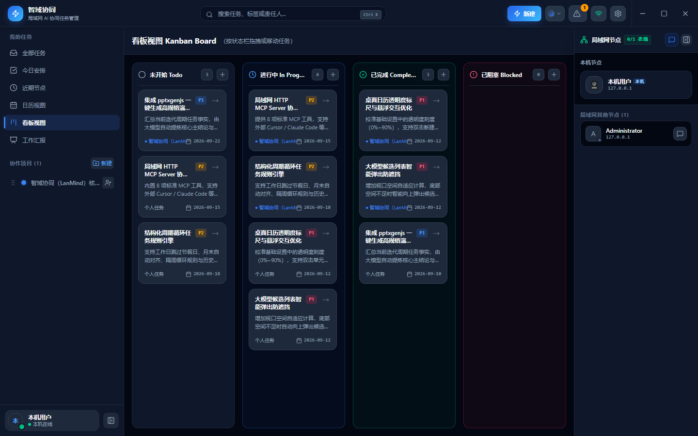
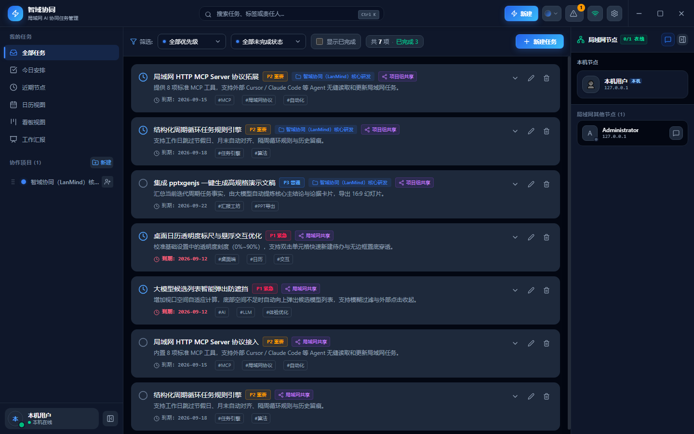
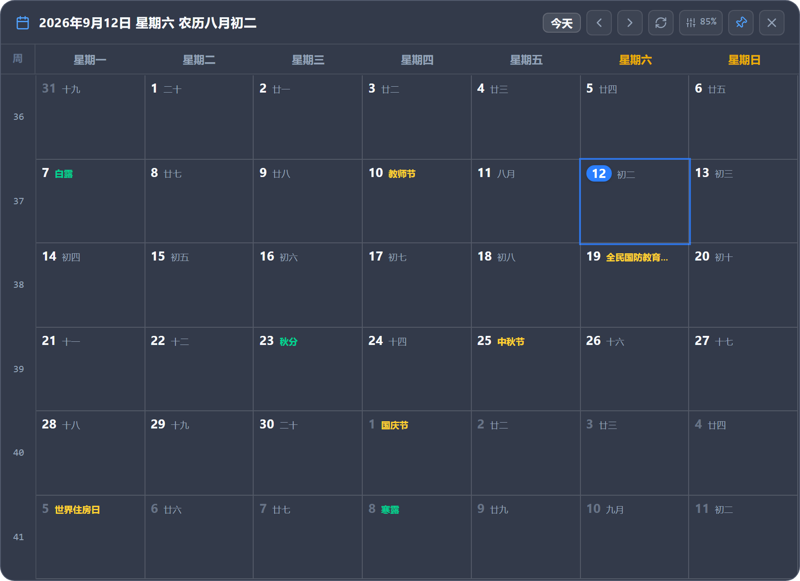
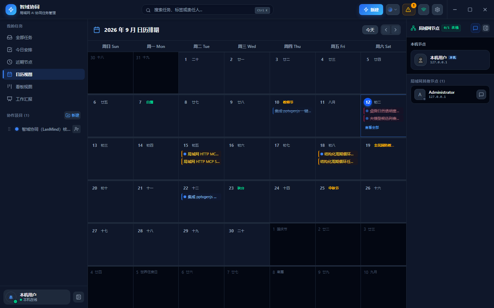
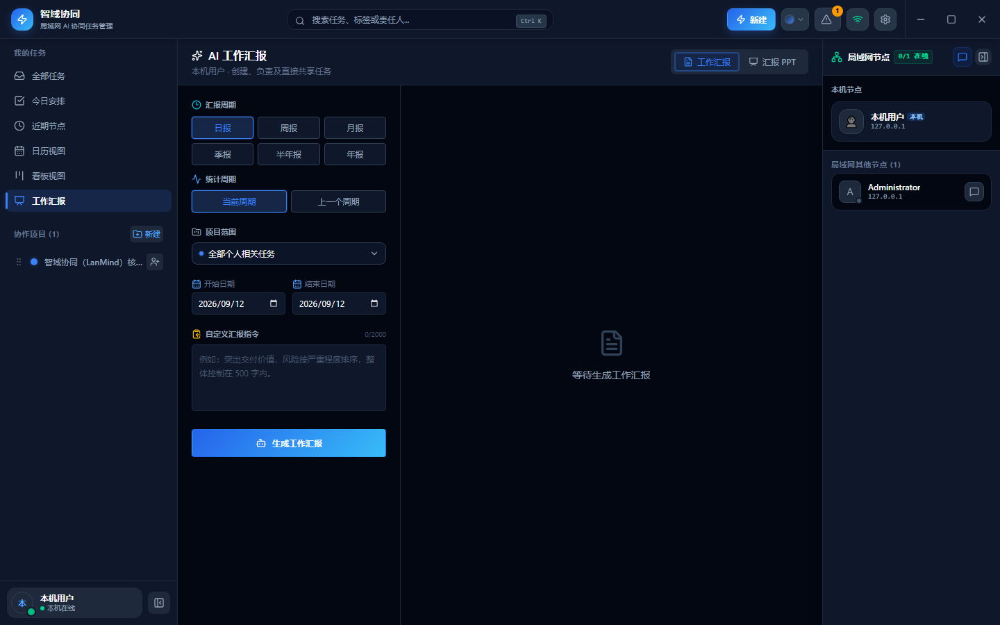
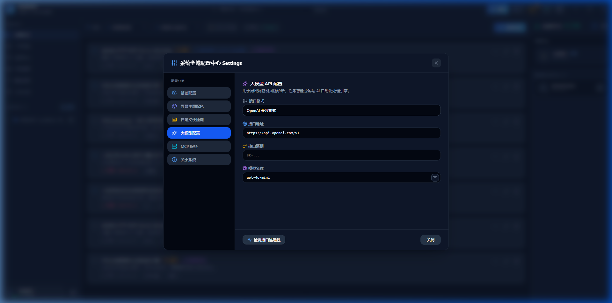

# 智域协同（LanMind）

> 当前桌面版本：0.1.1 · Windows · Tauri 2 · React 19 · SQLite

智域协同是一款面向办公室、项目现场和隔离内网团队的本地优先协作桌面应用。它把项目、任务、沟通、文件传输和工作汇报集中在一个 Windows 客户端中，通过局域网直接连接团队成员，不依赖中心业务服务器。

每台设备都保存自己的完整本地数据。即使暂时离线，成员仍可查看和维护已有任务；设备重新出现在局域网后，应用会继续交换增量变更。需要智能任务解析或工作汇报时，可以按需连接团队自己的 OpenAI 兼容模型服务。

## 适用场景

- 同一办公室或园区网络内的小型团队协作
- 无法使用公有云、需要本地保存业务数据的内网环境
- 临时项目组、交付现场和跨设备任务协同
- 希望把任务事实快速整理成日报、周报、月报和汇报 PPT 的团队

## 界面预览

### 1. 看板视图（Kanban Board）
直观的泳道化卡片流转、优先级标记、协同成员与实时局域网节点在线感知。



### 2. 任务清单视图（Task List）
支持多维度组合筛选（优先级/状态/日期/项目/标签）、子任务进度清单折叠与快捷打卡。



### 3. 半透明桌面日历挂件（Desktop Calendar Widget）
独立半透明桌面挂件窗口，支持贴附桌面底层（Pinned to Desktop）或始终置顶，整合农历、节气与法定调休，双击单元格快捷录入待办。



### 4. 月度日历排期（Calendar Schedule）
集中展示团队任务到期节点、循环任务未来排期与中国农历传统节假日。



### 5. AI 工作汇报工作室（AI Report Studio）
一键汇总周期任务事实，借助大模型自动萃取关键成果与论点，支持直接导出 16:9 PPTX 演示文档。



### 6. 系统全域配置中心（Settings & LLM）
支持私有化与 OpenAI 兼容大模型接入、在线拉取模型列表；提供桌面日历透明度/底色自由调节与局域网 MCP 服务管理。



## 核心功能

### 任务管理

- 管理个人任务和项目任务，支持 P1-P4 优先级、待处理、进行中、阻塞和已完成状态
- 设置负责人、截止日期、具体时刻、提前提醒、标签和子任务清单
- 使用全部任务、今日安排、近期节点、列表、看板和日历等视图组织工作
- 按标题、描述、标签、优先级和状态快速搜索或筛选任务
- 通过版本化 JSON 文件导入、导出当前账号可见的任务数据，重复任务不会覆盖本机记录
- 新任务被指派时在应用内提示，主窗口隐藏或最小化时发送系统通知

### 循环任务

- 支持每天、每 N 天、每周指定一个或多个星期、每 N 周、每月指定日期、每 N 月、每年指定月日和每 N 年
- 支持“每周一”“每周一至周五”“每两周的周一和周三”“每月 1 号”“每年 8 月 12 日”等日历规则
- 循环规则可以绑定本地执行时刻，例如“每周一 08:00”，并沿用任务的提前提醒设置
- 首次到期日期会自动对齐到最近的规则日期；每月 29-31 号及每年 2 月 29 日在无对应日期时按当月最后一天执行
- 完成当前任务后生成下一条任务；逾期多期时跳到未来最近一期，不堆积已经错过的周期
- 新任务保留标题、描述、负责人、优先级、项目、共享范围、标签、提醒和重置后的子任务清单
- 编辑当前循环任务会更新当前及后续规则，已完成的历史任务保持不变
- 日历展示活动循环任务的未来排期，已完成任务只显示实际到期记录

### 项目与权限

- 创建局域网协作项目，设置项目说明、标识色、成员和项目管理员
- 发现同一局域网中的可加入项目，通过申请和审批进入项目
- 项目管理员负责成员审批与权限管理，不设置全局中心管理员
- 项目任务可对全体项目成员共享，也可限制为创建者和负责人可见
- 未获批准的成员不能读取或创建该项目的任务

### 局域网协作

- 自动发现局域网节点，展示在线状态，并保留暂时离线的成员身份
- 通过增量操作日志同步项目、任务、成员资料和协作状态
- 支持手动触发同步并查看同步日志，便于定位网络或数据交换问题
- 提供全员广播、单聊、项目群聊和自定义协作群组
- 在聊天中发送文字、图片和文件；文件采用分块传输，支持断点续传和完整性校验
- 本机清空聊天记录不会删除其他成员设备上的历史记录

### 桌面日历（桌面挂件）

- 独立半透明桌面挂件窗口，支持贴附桌面底层（Pinned to Desktop）或始终置顶（Always on Top），`Win + D` 显示桌面不丢失
- 深度整合农历与节假日体系：支持农历月日、二十四节气、中国传统与法定节假日，以及调休/补班角标与悬浮详细提示
- 个性化半透明底色配置：支持“跟随应用主题”或“自定义颜色”（系统原生 1677 万色拾色器 + 6 款常用质感色卡），底色透明度 0%~100% 自由平滑调节，智能自适应前景文字明暗对比度
- 快捷创建待办：双击日历日期单元格弹出极简轻量录入弹窗；支持自然语言与 AI 智能语义分析（自动解析时间、优先级、项目、指派人与标签）；支持纯键盘极速盲打（`Enter` 保存，`Esc` 退出）；亦可一键跳转至主界面完整表单
- 桌面交互：支持鼠标穿透（防误触）、自由拖拽移动与位置记忆、原生右键菜单（快捷锁定、图层切换、刷新、快捷设置等）

### AI 工作能力

- 使用自然语言快速创建任务，自动提取标题、日期、时刻、优先级、项目、负责人、标签和结构化循环规则
- 扫描逾期、阻塞和高优先级任务，集中展示风险与待处理事项
- 基于真实任务记录生成日报、周报、月报、季度、半年或年度工作汇报
- 按时间范围、项目范围和自定义指令整理完成情况、关键进展、风险及后续计划
- 将生成的汇报导出为 16:9 PPTX，并支持选择或导入自定义演示主题
- 模型地址、模型名称和 API Key 均由用户配置，API Key 仅保存在本机；支持一键获取远端服务可用模型列表与连接测试

### MCP Agent 接入

- 桌面端可按需启用局域网 Streamable HTTP MCP Server，提供 8 大核心工具（`get_projects`、`list_tasks`、`create_task`、`update_task`、`delete_task`、`get_risks`、`export_tasks_archive`、`sync_now`）
- 让外部大模型客户端和 Agent 安全读取项目、任务与风险，并创建、修改或流式同步任务
- 可配置随系统登录静默启动至托盘，持续保持通知、快捷键和局域网同步能力
- MCP 调用始终使用当前桌面用户身份，复用正式 SQLite 权限、操作日志和 P2P 同步语义
- 服务默认关闭，使用本机随机 Bearer Token 鉴权；连接与安全说明见 [MCP 局域网接入](docs/MCP.md)

### 桌面体验与系统设置

- 单实例运行，再次启动应用时聚焦已有主窗口
- 关闭主窗口后继续在系统托盘运行；单击托盘图标可恢复主界面
- 提供独立的快捷创建窗口与半透明桌面日历，无需先打开完整工作台
- 支持全局快捷键、系统通知、深浅主题和可折叠工作区；主题可跟随系统，浅色使用钛白明亮、深色使用深蓝星空
- 设置面板体验全面升级：全 Tab 统一无感自动保存（Auto-Save），修改即时生效；大模型配置支持纯图标一键获取可用模型列表
- 托盘菜单可显示主界面、切换桌面日历挂件或安全退出应用

## 典型工作流程

1. 首次启动后设置本机节点名称和头像。
2. 同一局域网中的设备自动发现彼此，并显示在线状态。
3. 创建协作项目并邀请成员，或申请加入已发现的项目。
4. 在列表、看板、主工作台日历或桌面日历挂件中创建和推进任务，任务变更自动形成增量日志。
5. 在线节点交换获准访问的项目数据；离线节点重新上线后继续同步。
6. 团队通过广播、单聊或项目群组沟通并传输文件。
7. 按周期汇总任务事实，生成工作汇报并导出 PPTX。

## 产品架构

智域协同采用本地优先的点对点架构。交互界面、桌面能力、本地数据库和网络通信共同打包在客户端内，不需要部署独立的中心业务服务。

```text
┌──────────────────────── Windows 桌面客户端 ────────────────────────┐
│                                                                    │
│  任务 / 循环排期 / 项目 / 桌面日历 / 聊天 / 汇报界面                 │
│                    │                                               │
│                    ▼                                               │
│  桌面能力与业务编排                                                 │
│  窗口 · 托盘 · 快捷键 · 通知 · 权限校验 · 文件读写                   │
│          │                                      │                  │
│          ▼                                      ▼                  │
│  SQLite 本地数据库                       局域网 P2P 通信             │
│  任务规则 · 业务数据 · 操作日志           节点发现 · 同步 · 聊天 · 文件 │
└──────────┬──────────────────────────────────────┬──────────────────┘
           │                                      │
           │ 加密增量同步                          │ 可选调用
           ▼                                      ▼
      其他 LanMind 节点                    OpenAI 兼容模型服务
```

### 本地数据

- 每台设备拥有独立的 SQLite 数据库，本机数据库是该设备的事实来源。
- 数据库启用 WAL、外键和增量操作日志，业务操作与待同步变更在事务中写入。
- 首次运行只创建本机身份，不自动生成示例项目、任务、节点或同步日志。
- 核心任务管理能力不依赖互联网；模型服务不可用时，仅 AI 解析和汇报生成受影响。

### 应用分层

| 层 | 技术与位置 | 职责 |
| --- | --- | --- |
| 渲染层 | React 19、TypeScript、Vite，`src/` | 工作台、任务表单、循环规则、列表、看板、主日历、桌面日历挂件、聊天、主题与汇报界面 |
| 业务接口 | `src/services/api.ts` | 统一封装 Tauri IPC；浏览器预览模式可回退到 HTTP 接口 |
| 桌面核心 | Tauri 2、Rust，`src-tauri/src/lib.rs` | 命令注册、权限编排、模型调用、窗口生命周期、托盘、快捷键、通知与 MCP 服务 |
| 数据层 | SQLite、`src-tauri/src/db.rs` | 本地持久化、事务、权限过滤、风险扫描、汇报数据集和操作日志 |
| 网络层 | UDP/TCP、`src-tauri/src/network.rs` | 节点发现、加密同步、聊天、邀请和文件分块传输 |
| 共享契约 | `src/types.ts`、`src-tauri/src/models.rs` | TypeScript 与 Rust 的 camelCase JSON 数据结构 |

渲染层通过 `ApiService` 调用受信任的 Rust command。业务写入先落入本机 SQLite，并在同一数据模型中形成可同步操作；网络层接收远端操作后执行权限过滤和幂等应用，再通过 Tauri event 通知界面刷新。循环规则随任务 JSON 一同持久化和同步，不依赖后台调度服务。

### 节点发现与同步

- 节点发现使用 UDP `45991`，同时发送子网广播和 `239.255.45.91` 组播。
- 数据同步使用发现信息中声明的动态 TCP 端口，不需要固定的中心服务器地址。
- 变更以唯一操作 ID 传输，接收端按项目成员关系过滤，并以幂等方式应用。
- 节点离线期间可继续本地工作；重新上线后交换尚未接收的增量变更。
- 文件按 1 MiB 分块传输，使用 SHA-256 校验内容完整性。
- 高级循环规则随任务同步；协作节点应使用支持结构化循环规则的相同版本，以保证后续任务按同一规则生成。

### 安全与数据边界

- 局域网传输使用 ChaCha20-Poly1305 加密。
- 工作区业务数据与跨工作区局域网聊天使用不同的传输通道和密钥上下文。
- 项目访问由项目成员关系控制，发现节点或项目不等于获得项目数据权限。
- 大模型 API Key 只保存在本机，不进入项目数据、聊天消息或同步日志。
- 清空聊天记录属于本机操作，不向其他节点传播删除指令。

## 运行条件

### 使用环境

- Windows 10 或 Windows 11
- Microsoft Edge WebView2 Runtime
- 允许局域网通信的“专用网络”环境
- 可选：OpenAI 兼容的大模型接口，用于自然语言任务解析和工作汇报

设备通常需要位于可互相访问的同一局域网。访客 Wi-Fi、AP 客户端隔离、跨 VLAN 或被禁用的广播/组播可能阻止自动发现；Windows 防火墙也需要允许 LanMind 在专用网络中通信。

### 从源码启动

开发环境需要 Node.js 22+、Rust stable、Microsoft Edge WebView2 Runtime，以及包含 MSVC 和 Windows SDK 的 Visual Studio Build Tools。

```powershell
npm install
npm run desktop
```

常用命令：

```powershell
npm test               # 前端单元测试（循环规则、主题、农历节气、桌面日历）
npm run lint           # TypeScript 类型检查
npm run build          # 构建前端界面资源
npm run desktop        # 启动完整桌面开发模式（Tauri 2 + Vite）
npm run desktop:build  # 生成 Windows 安装包（NSIS .exe 与 MSI）
cd src-tauri; cargo test # Rust 数据层、P2P 网络与 MCP 全套测试（44 项覆盖）
```

`npm run dev` 仅用于浏览器中的界面预览。SQLite、局域网发现与同步、托盘、通知、全局快捷键和文件传输等完整能力需要通过 `npm run desktop` 运行。

构建完成后，可在以下位置找到安装包：

```text
src-tauri/target/release/bundle/nsis/*-setup.exe
src-tauri/target/release/bundle/msi/*.msi
```

## 网络排查

局域网节点无法互相发现时，依次确认：

1. 两台设备连接到同一可互访网络，且 Windows 网络类型为“专用”。
2. Windows 防火墙允许 LanMind 通过专用网络通信。
3. 无线网络没有启用访客隔离或 AP 客户端隔离。
4. 网络策略没有阻断 UDP 广播、组播或节点间 TCP 连接。
5. 修改网络设置后，重新启动客户端并等待一次发现周期。

## 进一步了解

- [架构说明](docs/ARCHITECTURE.md)：数据模型、通信边界、同步规则和桌面生命周期
- [测试手册](docs/TESTING.md)：自动化检查、桌面回归、双节点联调和发布验证
- [MCP 接入](docs/MCP.md)：Model Context Protocol 局域网生态工具规范与接口说明

